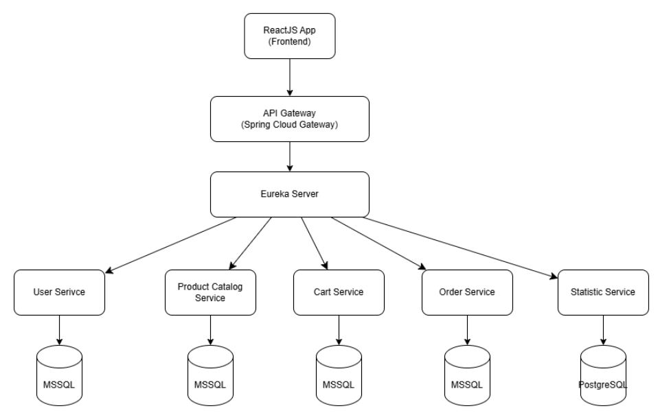
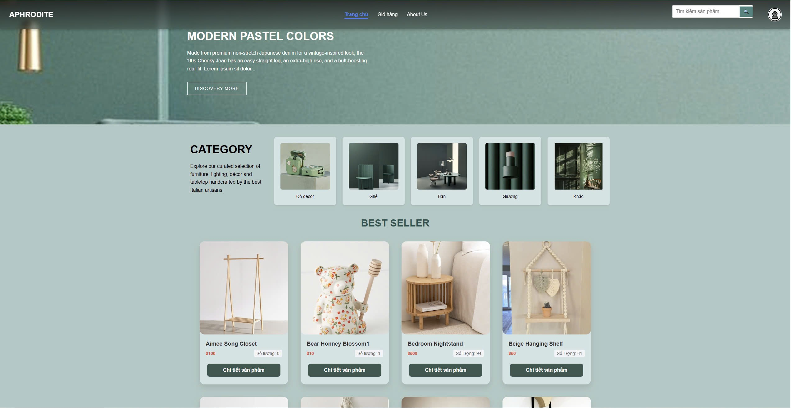
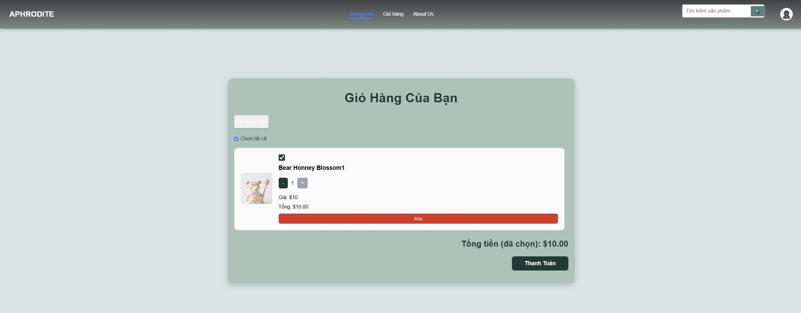
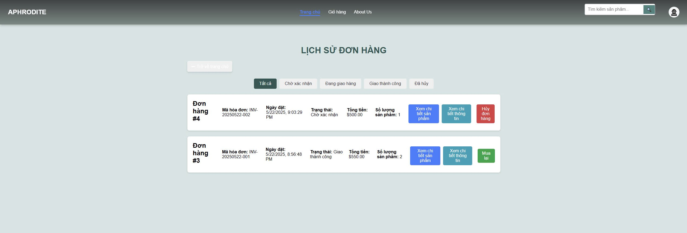
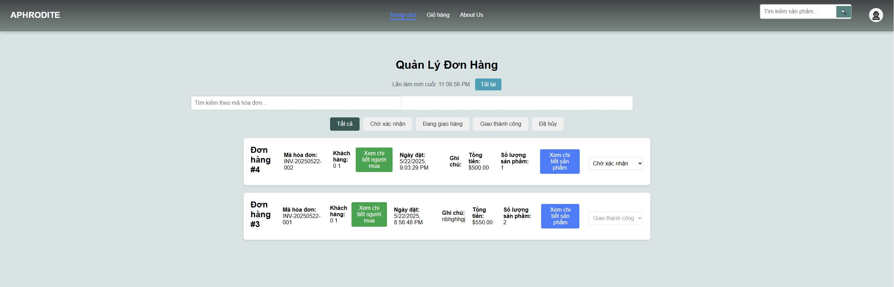
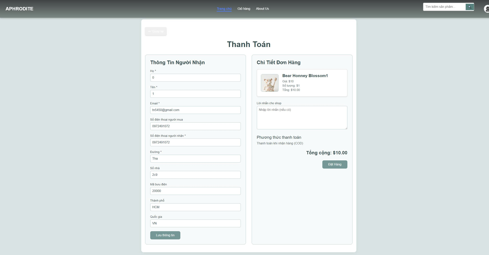
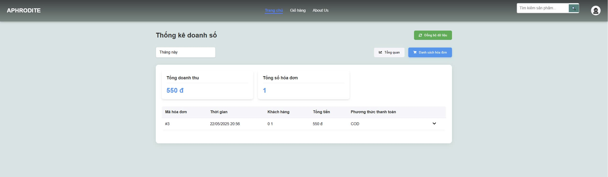
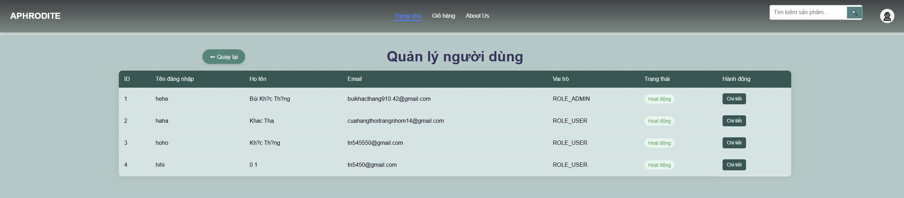
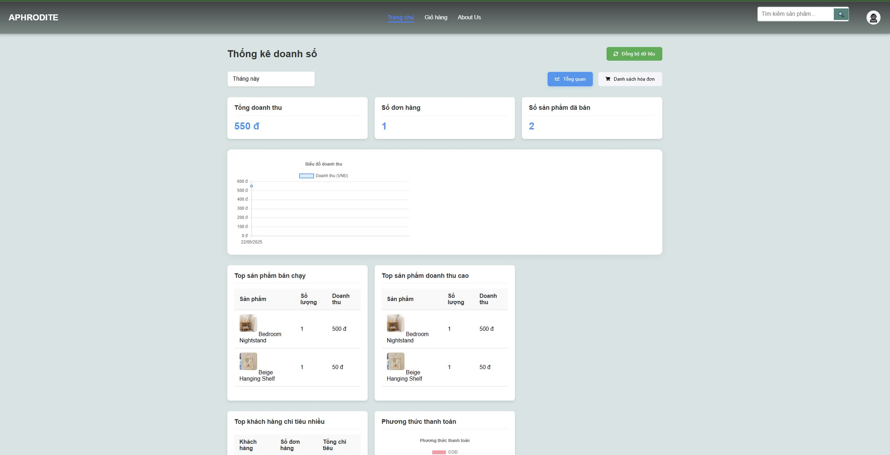

# 🌟 Microservices Magic with Spring Boot and ReactJS

> **"May your code run smoothly and your microservices thrive!"**

---

## 🎉 Welcome to the Adventure!

Chào mừng đến với một hành trình đầy sắc màu cùng hệ thống ứng dụng Microservices hiện đại!  
Được xây dựng bằng **Spring Boot** mạnh mẽ ở backend và **ReactJS** lung linh ở frontend, đây là dự án tiêu biểu cho kiến trúc phần mềm hiện đại và có khả năng mở rộng cao.

📦 **Cơ sở dữ liệu sử dụng:**  
- MS SQL Server  
- PostgreSQL  
- Redis  

👨‍💻 **Tác giả:** [Hungdacam](https://github.com/Hungdacam)

---

## 🚀 Tech Stack

| Layer       | Technology               |
|------------|---------------------------|
| Frontend   | ReactJS, Docker           |
| Backend    | Spring Boot, Java 17      |
| API Gateway| Spring Cloud Gateway      |
| Service Reg| Eureka Server             |
| Databases  | MS SQL Server, PostgreSQL |
| Caching    | Redis                     |
| Orchestration | Docker, Docker Compose |

---

## 📁 Folder Structure (Cơ bản)

```

📦 RF_FurnitureEcommerce_G3-
├── .idea/ # Cấu hình IDE
├── api-gateway/ # Spring Cloud Gateway (Cổng API)
├── cart-service/ # Dịch vụ giỏ hàng
├── eureka-server/ # Service Discovery (Eureka)
├── frontend/ # Ứng dụng ReactJS (Giao diện)
├── init-scripts/ # Script tạo CSDL ban đầu
├── invoices/ # Quản lý hóa đơn
├── order-service/ # Dịch vụ đặt hàng
├── product-catalog-service/ # Dịch vụ quản lý sản phẩm
├── product-recommendation-service/ # Gợi ý sản phẩm
├── statistics-service/ # Phân tích thống kê
├── user-service/ # Quản lý người dùng
├── docker/ # Cấu hình Docker bổ sung
├── docker-compose/ # Dockerfile cho các service
├── docker-compose.yml # Khởi tạo toàn bộ hệ thống
├── .gitignore
└── README.md # Tài liệu dự án 

````

---

## 🛠️ Prerequisites

Trước khi bắt đầu, hãy đảm bảo bạn đã cài đặt:

- [Docker](https://www.docker.com/)
- [Docker Compose](https://docs.docker.com/compose/)
- [Java 17](https://www.oracle.com/java/technologies/javase/jdk17-archive-downloads.html)
- [Node.js](https://nodejs.org/) và npm

---

## 🔧 Hướng dẫn chạy dự án

### ✅ 1. Clone repository

```bash
git clone https://github.com/Hungdacam/RF_FurnitureEcommerce_G3-
cd RF_FurnitureEcommerce_G3-
````

### ✅ 2. Khởi động Backend

```bash
docker-compose up --build
```

👉 Lệnh này sẽ:

* Build và chạy các microservices (`eureka-server`, `api-gateway`, `user-service`, v.v.)
* Khởi động MS SQL Server, PostgreSQL và Redis

**✅ Kiểm tra Backend hoạt động:**
Truy cập: [http://localhost:8900/actuator/health](http://localhost:8900/actuator/health)
Kết quả mong đợi: `{"status":"UP"}`

---

### ✅ 3. Khởi động Frontend

```bash
cd frontend
npm install
npm run build
```

Nếu frontend chưa tự chạy theo docker-compose, chạy riêng:

```bash
docker-compose up frontend
```

**Hoặc dùng lệnh riêng:**

```bash
npm run docker:build
npm run docker:run
```

**✅ Kiểm tra Frontend hoạt động:**
Truy cập: [http://localhost:3000](http://localhost:3000)

---

## 🐛 Troubleshooting

| Tình huống             | Giải pháp                                                                 |
| ---------------------- | ------------------------------------------------------------------------- |
| Backend không phản hồi | `docker-compose logs` để kiểm tra lỗi                                     |
| Frontend không kết nối | Kiểm tra port trong `docker-compose.yml`, đảm bảo `api-gateway` hoạt động |
| Conflict port          | Kiểm tra ứng dụng nào khác đang chiếm port 3000, 8900, 8761...            |
| Redis lỗi              | Đảm bảo Redis container được khởi tạo đúng (có trong compose)             |

---

## 🛑 Dừng toàn bộ dịch vụ

```bash
docker-compose down
```

> Dữ liệu trong volumes vẫn được giữ nguyên.

---

## ⚙️ Configuration Tips

Môi trường cấu hình qua file .env hoặc docker-compose.yml

Các script khởi tạo DB nằm trong thư mục init-scripts

Spring Boot chạy với profile docker
---
---

## 🖼️ Giao diện và Chức năng Demo

> Một số ảnh chụp minh họa các chức năng chính của hệ thống

### 🧠 Kiến trúc Microservices



---

### 🏠 Trang chủ



---

### 🛒 Giỏ hàng



---

### 📦 Lịch sử đơn hàng



---

### 📋 Quản lý đơn hàng



---

### 💵 Thanh toán



---

### 📈 Thống kê doanh thu



---

### 👤 Quản lý người dùng



---

### 📊 Tổng quan thống kê



---

## 🌈 Happy Coding!

> 🚀 **Hãy để microservices của bạn tỏa sáng!**
> 💻 **Chúc bạn viết code không bug và deploy không lỗi!**

---

